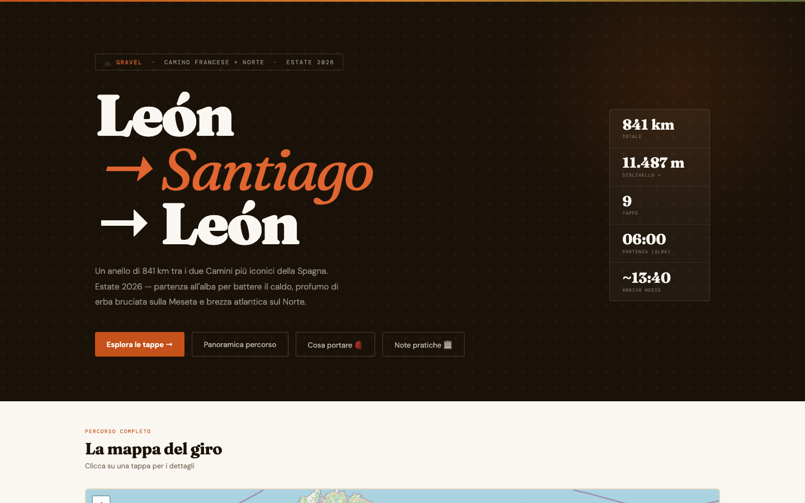
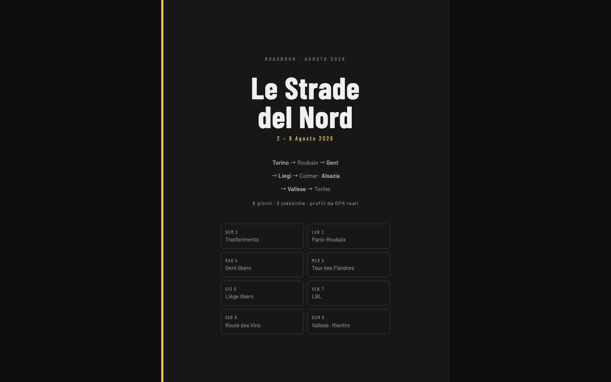
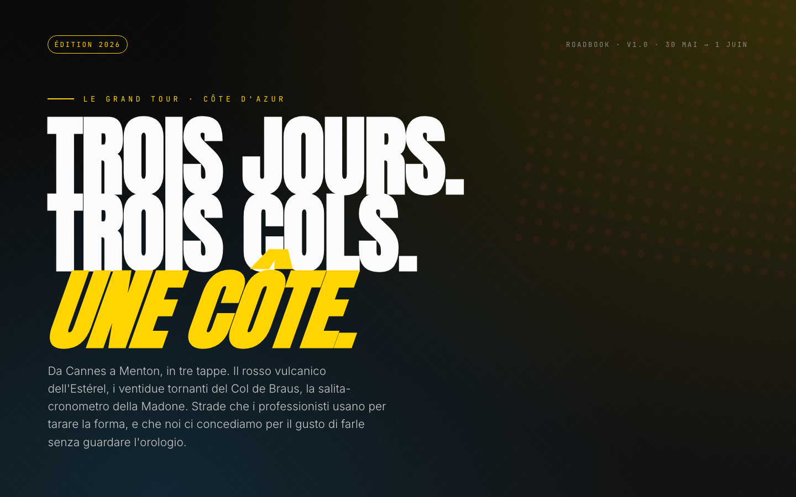
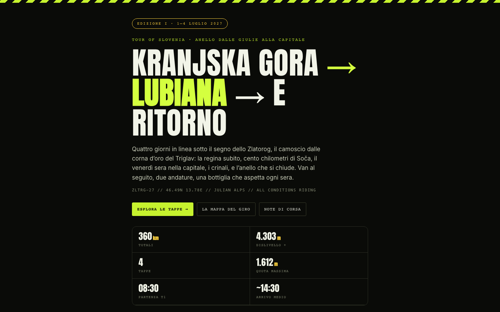

# Cycling Routes

Four hand-built websites for planning multi-day cycling trips: roadbooks with stages, maps, elevation profiles and GPX tracks. All plain HTML/CSS/JS, no frameworks.

The sites are in Italian because they are made to be used with friends, on the road.

Each site is **deliberately built differently from the others**: different layout, different visual identity, different way of handling maps and the mobile version. That is the point. Every trip was also an excuse to try a new approach and learn something. For the same reason, two sites are deployed on **Netlify** and two on **Vercel**, to get hands-on with both platforms.

| Project | Live site | Host | What I explored |
|---|---|---|---|
| **Camino en Bici** · León ↔ Santiago 2026 | [camino2026gas.netlify.app](https://camino2026gas.netlify.app/) | Netlify | Fully self-contained single file: GPX tracks inlined in the page, Leaflet maps, packing list. Works offline once loaded |
| **Week of the Northern Classics** (Le Strade del Nord) · Roubaix, Flanders, Liège · 2026 | [le-strade-del-nord.vercel.app](https://le-strade-del-nord.vercel.app/) | Vercel | Editorial dark/gold design, Komoot route embeds instead of self-hosted maps |
| **Le Grand Tour de la Côte d'Azur** · 2026 | [roadbook-cotedazur.vercel.app](https://roadbook-cotedazur.vercel.app/) | Vercel | Leaflet + Chart.js elevation profiles from raw GPX, downloadable tracks |
| **Zlatorog** · Tour of Slovenia | [tourofslovenia2026.netlify.app](https://tourofslovenia2026.netlify.app/) | Netlify | Four-stage roadbook structure, Leaflet maps, custom SVG identity, GPX downloads |

Mobile-first attention throughout: these pages get used on a phone, on the road, mid-climb.

## Structure

One folder per site, each self-contained (`index.html` + assets). GPX files live next to the site that uses them.
